See <https://github.com/DataTalksClub/data-engineering-zoomcamp/tree/main/week_2_workflow_orchestration>

# 2.0 Data Lake

> 2023-01-24.

See [DE Zoomcamp 2.1.1 - Data Lake](https://www.youtube.com/watch?v=W3Zm6rjOq70) on Youtube.

## 00:17 What is a Data Lake?

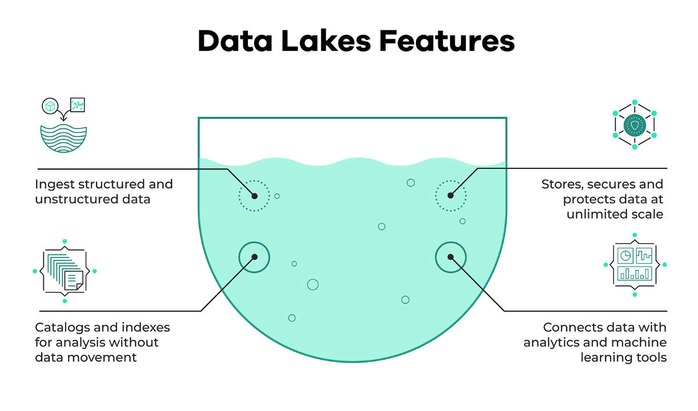

## 01:20 Data Lake vs Data Warehouse


## 02:12 How did Data Lake start?

- Companies realized the value of data

- Store and access data quickly

- Cannot always define structure of data

- Usefulness of data being realized later in the project lifecycle

- Increase in data scientists

- R&D on data products

- Need for Cheap storage of Big data

## 03:39 ETL vs ELT

- Extract Transform and Load (ETL) vs Extract Load and Transform (ELT)

- ETL is mainly used for a small amount of data whereas ELT is used for large amounts of data

- ELT provides data lake support (Schema on read)

## 04:37 Gotchas of Data Lake

- Converting into Data Swamp

- No versioning

- Incompatible schemas for same data without versioning

- No metadata associated

- Joins not possible

## 06:10 Cloud provider Data Lake

- GCP - cloud storage

- AWS - S3

- AZURE - AZURE BLOB

# 2.1 Introduction to Workflow Orchestration

> 2023-01-24.

See [DE Zoomcamp 2.2.1 - Introduction to Workflow Orchestration](https://www.youtube.com/watch?v=8oLs6pzHp68) on
Youtube.

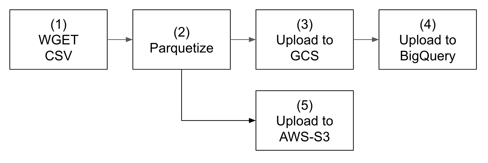

- [Luigi](https://github.com/spotify/luigi) (prefered tool of Alexdry…​)

- [Apache Airflow](https://airflow.apache.org/) (most popular)

- [Prefect](https://www.prefect.io/)

# 2.2 Introduction to Prefect concepts

> 2023-01-24.

See [DE Zoomcamp 2.2.2 - Introduction to Prefect concepts](https://www.youtube.com/watch?v=jAwRCyGLKOY) on Youtube and
[GitHub repository](https://github.com/discdiver/prefect-zoomcamp)

## Setup environment

Let’s first create a conda environment. We need a python requirements file.

<div class="formalpara-title">

**File `requirements.txt`**

</div>

``` txt
pandas==1.5.2
prefect==2.7.7
prefect-sqlalchemy==0.2.2
prefect-gcp[cloud_storage]==0.2.4
protobuf==4.21.11
pyarrow==10.0.1
pandas-gbq==0.18.1
psycopg2-binary==2.9.5
sqlalchemy==1.4.46
```

I ran these commands to create x86 environment, because I was getting an error message with arm64 due to the fact that
greenlet is not yet available under arm.

``` bash
# conda create -n zoom python=3.9
create_x86_conda_environment zoom python=3.9
conda activate zoom
pip install -r requirements.txt
```

## Ingestion without prefect

<div class="formalpara-title">

**File `ingest-data.py`**

</div>

``` python
#!/usr/bin/env python
# coding: utf-8
import os
import argparse
from time import time
import pandas as pd
from sqlalchemy import create_engine

def ingest_data(user, password, host, port, db, table_name, csv_url):

    # the backup files are gzipped, and it's important to keep the correct extension
    # for pandas to be able to open the file
    if csv_url.endswith('.csv.gz'):
        csv_name = 'yellow_tripdata_2021-01.csv.gz'
    else:
        csv_name = 'output.csv'

    os.system(f"wget {csv_url} -O {csv_name}")
    postgres_url = f'postgresql://{user}:{password}@{host}:{port}/{db}'
    engine = create_engine(postgres_url)

    df_iter = pd.read_csv(csv_name, iterator=True, chunksize=100000)

    df = next(df_iter)

    df.tpep_pickup_datetime = pd.to_datetime(df.tpep_pickup_datetime)
    df.tpep_dropoff_datetime = pd.to_datetime(df.tpep_dropoff_datetime)

    df.head(n=0).to_sql(name=table_name, con=engine, if_exists='replace')

    df.to_sql(name=table_name, con=engine, if_exists='append')

    while True:

        try:
            t_start = time()

            df = next(df_iter)

            df.tpep_pickup_datetime = pd.to_datetime(df.tpep_pickup_datetime)
            df.tpep_dropoff_datetime = pd.to_datetime(df.tpep_dropoff_datetime)

            df.to_sql(name=table_name, con=engine, if_exists='append')

            t_end = time()

            print('inserted another chunk, took %.3f second' % (t_end - t_start))

        except StopIteration:
            print("Finished ingesting data into the postgres database")
            break

if __name__ == '__main__':
    user = "root"
    password = "root"
    host = "localhost"
    port = "5432"
    db = "ny_taxi"
    table_name = "yellow_taxi_trips"
    csv_url = "https://github.com/DataTalksClub/nyc-tlc-data/releases/download/yellow/yellow_tripdata_2021-01.csv.gz"

    ingest_data(user, password, host, port, db, table_name, csv_url)
```

I started Docker Desktop and executed these commands.

``` bash
mkdir ny_taxi_postgres_data
docker run -d \
  -e POSTGRES_USER="root" \
  -e POSTGRES_PASSWORD="root" \
  -e POSTGRES_DB="ny_taxi" \
  -v $(pwd)/ny_taxi_postgres_data:/var/lib/postgresql/data \
  -p 5432:5432 \
  postgres:13
```

Then, I executed the python program.

``` bash
python ingest_data.py
```

I then opened pgcli.

``` bash
pgcli -h localhost -p 5432 -u root -d ny_taxi
```

And I ran these sql queries.

``` txt
Password for root:
Server: PostgreSQL 13.9 (Debian 13.9-1.pgdg110+1)
Version: 3.5.0
Home: http://pgcli.com
root@localhost:ny_taxi> \dt
+--------+-------------------+-------+-------+
| Schema | Name              | Type  | Owner |
|--------+-------------------+-------+-------|
| public | yellow_taxi_trips | table | root  |
+--------+-------------------+-------+-------+
SELECT 1
Time: 0.037s
root@localhost:ny_taxi> select count(1) FROM yellow_taxi_trips;
+---------+
| count   |
|---------|
| 1369765 |
+---------+
SELECT 1
Time: 4.728s (4 seconds), executed in: 4.723s (4 seconds)
root@localhost:ny_taxi> drop table yellow_taxi_trips;
You're about to run a destructive command.
Do you want to proceed? (y/n): y
Your call!
DROP TABLE
Time: 0.066s
root@localhost:ny_taxi>
```

`Ctrl+D` to quit pgcli.

## Ingestion with prefect

I modified the python program to use prefect.

See
[ingest_data_flow.py](https://raw.githubusercontent.com/discdiver/prefect-zoomcamp/main/flows/01_start/ingest_data_flow.py).

<div class="formalpara-title">

**File `ingest_data_flow.py`**

</div>

``` python
#!/usr/bin/env python
# coding: utf-8
import os
import argparse
from time import time
import pandas as pd
from sqlalchemy import create_engine
from prefect import flow, task
from prefect.tasks import task_input_hash
from datetime import timedelta
from prefect_sqlalchemy import SqlAlchemyConnector


@task(log_prints=True, tags=["extract"], cache_key_fn=task_input_hash, cache_expiration=timedelta(days=1))
def extract_data(url: str):
    # the backup files are gzipped, and it's important to keep the correct extension
    # for pandas to be able to open the file
    if url.endswith('.csv.gz'):
        csv_name = 'yellow_tripdata_2021-01.csv.gz'
    else:
        csv_name = 'output.csv'

    os.system(f"wget {url} -O {csv_name}")

    df_iter = pd.read_csv(csv_name, iterator=True, chunksize=100000)

    df = next(df_iter)

    df.tpep_pickup_datetime = pd.to_datetime(df.tpep_pickup_datetime)
    df.tpep_dropoff_datetime = pd.to_datetime(df.tpep_dropoff_datetime)

    return df

@task(log_prints=True)
def transform_data(df):
    print(f"pre: missing passenger count: {df['passenger_count'].isin([0]).sum()}")
    df = df[df['passenger_count'] != 0]
    print(f"post: missing passenger count: {df['passenger_count'].isin([0]).sum()}")
    return df

@task(log_prints=True, retries=3)
def load_data(table_name, df):

    connection_block = SqlAlchemyConnector.load("postgres-connector")
    with connection_block.get_connection(begin=False) as engine:
        df.head(n=0).to_sql(name=table_name, con=engine, if_exists='replace')
        df.to_sql(name=table_name, con=engine, if_exists='append')

@flow(name="Subflow", log_prints=True)
def log_subflow(table_name: str):
    print(f"Logging Subflow for: {table_name}")

@flow(name="Ingest Data")
def main_flow(table_name: str = "yellow_taxi_trips"):

    csv_url = "https://github.com/DataTalksClub/nyc-tlc-data/releases/download/yellow/yellow_tripdata_2021-01.csv.gz"
    log_subflow(table_name)
    raw_data = extract_data(csv_url)
    data = transform_data(raw_data)
    load_data(table_name, data)

if __name__ == '__main__':
    main_flow(table_name = "yellow_trips")
```

I started Docker Desktop and executed these commands.

``` bash
mkdir ny_taxi_postgres_data
docker run -d \
  -e POSTGRES_USER="root" \
  -e POSTGRES_PASSWORD="root" \
  -e POSTGRES_DB="ny_taxi" \
  -v $(pwd)/ny_taxi_postgres_data:/var/lib/postgresql/data \
  -p 5432:5432 \
  postgres:13
```

Start the Prefect Orion orchestration engine.

``` bash
prefect orion start
```

Open another terminal window and run the following command:

``` bash
prefect config set PREFECT_API_URL=http://127.0.0.1:4200/api
```

Go to <http://127.0.0.1:4200/> to open the Orion interface.

You can consult a lot of information about our performances.

We are interested in **Blocks**.

At 26:33, we go to <https://docs.prefect.io/collections/catalog/>

See also <https://prefecthq.github.io/prefect-sqlalchemy/>

But the instructor suggests instead to add the block **SQLAlchemy Connector** from the interface **Blocks** of Orion.

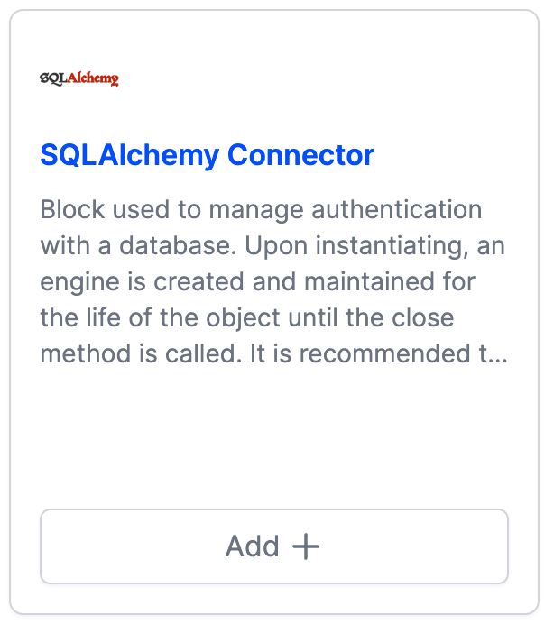

Write or select these parameters :

- **Block Name**: postgres-connector

- **Driver**: SyncDriver

- **The driver name to use**: postgresql+psycopg2

- **The name of the database to use**: ny_taxi

- **Username**: root

- **Password**: root

- **Host**: localhost

- **Port**: 5432

Then click on the **Create** button

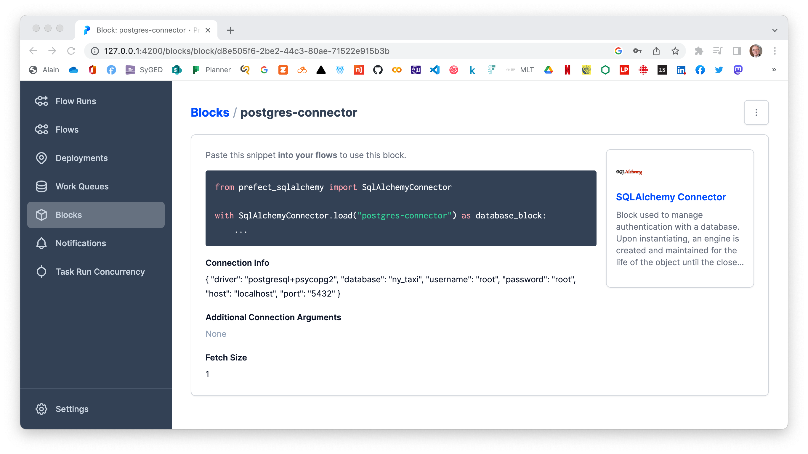

The Orion interface provides us with instructions to add in our python code.

``` python
from prefect_sqlalchemy import SqlAlchemyConnector

with SqlAlchemyConnector.load("postgres-connector") as database_block:
    ...
```

Then, I executed the python program.

``` bash
python ingest_data_flow.py
```

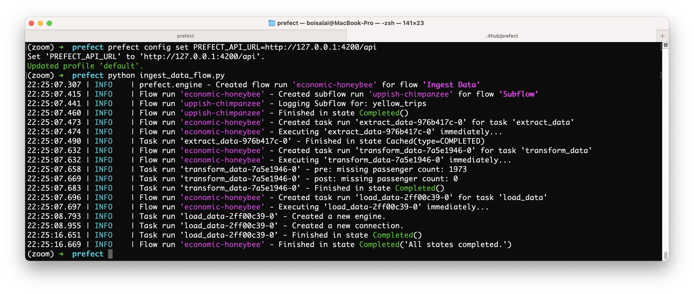

I then opened pgcli.

``` bash
pgcli -h localhost -p 5432 -u root -d ny_taxi
```

And I ran these sql queries.

``` txt
Password for root:
Server: PostgreSQL 13.9 (Debian 13.9-1.pgdg110+1)
Version: 3.5.0
Home: http://pgcli.com
root@localhost:ny_taxi> \dt
+--------+--------------+-------+-------+
| Schema | Name         | Type  | Owner |
|--------+--------------+-------+-------|
| public | yellow_trips | table | root  |
+--------+--------------+-------+-------+
SELECT 1
Time: 0.034s
root@localhost:ny_taxi> select count(1) FROM yellow_trips;
+-------+
| count |
|-------|
| 98027 |
+-------+
SELECT 1
Time: 0.049s
root@localhost:ny_taxi>
root@localhost:ny_taxi> drop table yellow_trips;
You're about to run a destructive command.
Do you want to proceed? (y/n): y
Your call!
DROP TABLE
Time: 0.062s
root@localhost:ny_taxi>
Goodbye!
```

`Ctrl+D` to quit pgcli.

`Ctrl+C` to quit Orion.

# 2.3 ETL with GCP & Prefect

> 2023-01-26

See [DE Zoomcamp 2.2.3 - ETL with GCP & Prefect](https://www.youtube.com/watch?v=W-rMz_2GwqQ) on Youtube and the
[source code](https://github.com/discdiver/prefect-zoomcamp/tree/main/flows/02_gcp).

## Start Prefect Orien

Start Prefect Orion.

``` bash
cd ~/github/flows
# create_x86_conda_environment zoom python=3.9
conda activate zoom
prefect orion start
```

You should see in the terminal this.

``` txt
 ___ ___ ___ ___ ___ ___ _____    ___  ___ ___ ___  _  _
| _ \ _ \ __| __| __/ __|_   _|  / _ \| _ \_ _/ _ \| \| |
|  _/   / _|| _|| _| (__  | |   | (_) |   /| | (_) | .` |
|_| |_|_\___|_| |___\___| |_|    \___/|_|_\___\___/|_|\_|

Configure Prefect to communicate with the server with:

    prefect config set PREFECT_API_URL=http://127.0.0.1:4200/api

View the API reference documentation at http://127.0.0.1:4200/docs

Check out the dashboard at http://127.0.0.1:4200
```

Check out the dashboard at <http://127.0.0.1:4200>

## Create and run python program

Create the file `etl_web_to_gcs.py`.

<div class="formalpara-title">

**File `etl_web_to_gcs.py`**

</div>

``` python
from pathlib import Path
import pandas as pd
from prefect import flow, task
from prefect_gcp.cloud_storage import GcsBucket
from random import randint


@task(retries=3)
def fetch(dataset_url: str) -> pd.DataFrame:
    """Read taxi data from web into pandas DataFrame"""
    # if randint(0, 1) > 0:
    #     raise Exception

    df = pd.read_csv(dataset_url)
    return df


@task(log_prints=True)
def clean(df: pd.DataFrame) -> pd.DataFrame:
    """Fix dtype issues"""
    df["tpep_pickup_datetime"] = pd.to_datetime(df["tpep_pickup_datetime"])
    df["tpep_dropoff_datetime"] = pd.to_datetime(df["tpep_dropoff_datetime"])
    print(df.head(2))
    print(f"columns: {df.dtypes}")
    print(f"rows: {len(df)}")
    return df


@task()
def write_local(df: pd.DataFrame, color: str, dataset_file: str) -> Path:
    """Write DataFrame out locally as parquet file"""
    Path(f"data/{color}").mkdir(parents=True, exist_ok=True)
    path = Path(f"data/{color}/{dataset_file}.parquet")
    df.to_parquet(path, compression="gzip")
    return path


@flow()
def etl_web_to_gcs() -> None:
    """The main ETL function"""
    color = "yellow"
    year = 2021
    month = 1
    dataset_file = f"{color}_tripdata_{year}-{month:02}"
    dataset_url = f"https://github.com/DataTalksClub/nyc-tlc-data/releases/download/{color}/{dataset_file}.csv.gz"

    df = fetch(dataset_url)
    df_clean = clean(df)
    path = write_local(df_clean, color, dataset_file)


if __name__ == "__main__":
    etl_web_to_gcs()
```

Run the code.

``` bash
python 02_gcp/etl_web_to_gcs.py
```

> 17:07/55:02

We should have 1369765 rows.

## Create a bucket

Go to [Gougle Cloud Console](https://console.cloud.google.com/).

In the **dtc-dez** project, select **Cloud Storage**, and select **Buckets**. I already have a backup called
**dtc_data_lake_hopeful-summer-375416**. The instructor uses a bucket named **prefect-de-zoomcamp**.

Inside Orion, select **Blocks** at the left menu, choose the block **GCS Bucket** and click **Add +** button. Complete
the form with:

- Block Name: zoom-gcs

- Name of the bucket: dtc_data_lake_hopeful-summer-375416


## Save credentials

> 27:15/35:02

Under **Gcp Credentials**, click on **Add +** button to create a **GCP Credentials** with these informations:

- Block Name: zoom-gcp-creds


## Create service account

On **Google Cloud Console**, select **IAM & Admin**, and **Service Accounts**. Then click on **+ CREATE SERVICE
ACCOUNT** with these informations:

- Service account details: zoom-de-service-account


Click on **CREATE AND CONTINUE** button.

Give the roles **BigQuery Admin** and **Storage Admin**.


Click on **CONTINUE** button.

> 28:42/35:02

Click on **DONE** button.

## Add the new key to the service account

Then, add a key on it. Click on **ADD KEY +** button, select **CREATE A NEW KEY**, select **JSON** and click on
**CREATE** button.

|                           |                           |
|---------------------------|---------------------------|
|  |  |

A private key (`hopeful-summer-375416-c150de675a7d.json`) is saved to my computer.

Move this json file under `~/opt/gcp/` directory.

Past the content of the public key inside the form of the Prefect Orion.

``` bash
cat ~/opt/gcp/hopeful-summer-375416-c150de675a7d.json | pbcopy
```

<div class="note">

Note that we can create bucket directly from cli.

**prefect-gcp** is a collection of prebuilt Prefect tasks that can be used to quickly construct Prefect flows. See
[prefect-gcp](https://prefecthq.github.io/prefect-gcp/) or
[here](https://github.com/PrefectHQ/prefect-gcp/blob/main/README.md) for more information about **prefect_gcp**.

``` bash
prefect orion start
prefect block register -m prefect_gcp
```

Need to know how to do it!

</div>

## Return to our bucket and create it

When returning to the Orion form to create the **GCS Bucket**, which is called **zoom-gcs**, make sure the **Gcp
Credentials** field says **zoom-gcp-creds**.


> 30:24/35:02

Then click on **Create** button.

## Modify our python program

We then obtain a fragment of code to insert into our python code. Which allows us to add the `write_gcs` method to
`etl_web_to_gcs.py`.


<div class="formalpara-title">

**File `etl_web_to_gcs.py`**

</div>

``` python
from pathlib import Path
import pandas as pd
from prefect import flow, task
from prefect_gcp.cloud_storage import GcsBucket
from random import randint
import os


@task(retries=3)
def fetch(dataset_url: str) -> pd.DataFrame:
    """Read taxi data from web into pandas DataFrame"""
    # if randint(0, 1) > 0:
    #     raise Exception

    df = pd.read_csv(dataset_url)
    return df


@task(log_prints=True)
def clean(df: pd.DataFrame) -> pd.DataFrame:
    """Fix dtype issues"""
    df["tpep_pickup_datetime"] = pd.to_datetime(df["tpep_pickup_datetime"])
    df["tpep_dropoff_datetime"] = pd.to_datetime(df["tpep_dropoff_datetime"])
    print(df.head(2))
    print(f"columns: {df.dtypes}")
    print(f"rows: {len(df)}")
    return df


@task()
def write_local(df: pd.DataFrame, color: str, dataset_file: str) -> Path:
    """Write DataFrame out locally as parquet file"""
    Path(f"data/{color}").mkdir(parents=True, exist_ok=True)
    path = Path(f"data/{color}/{dataset_file}.parquet")
    df.to_parquet(path, compression="gzip")
    return path


@task
def write_gcs(path: Path) -> None:
    """Upload local parquet file to GCS"""
    gcs_block = GcsBucket.load("zoom-gcs")
    gcs_block.upload_from_path(from_path=path, to_path=path)
    return


@flow()
def etl_web_to_gcs() -> None:
    """The main ETL function"""
    color = "yellow"
    year = 2021
    month = 1
    dataset_file = f"{color}_tripdata_{year}-{month:02}"
    dataset_url = f"https://github.com/DataTalksClub/nyc-tlc-data/releases/download/{color}/{dataset_file}.csv.gz"

    df = fetch(dataset_url)
    df_clean = clean(df)
    path = write_local(df_clean, color, dataset_file)
    write_gcs(path)


if __name__ == "__main__":
    etl_web_to_gcs()
```

## Run the python program again

Let’s run the python program again.

``` bash
python 02_gcp/etl_web_to_gcs.py
```

``` txt
(zoom) ➜  flows python 02_gcp/etl_web_to_gcs.py
20:58:28.249 | INFO    | prefect.engine - Created flow run 'outgoing-hyena' for flow 'etl-web-to-gcs'
20:58:28.329 | INFO    | Flow run 'outgoing-hyena' - Created task run 'fetch-b4598a4a-0' for task 'fetch'
20:58:28.330 | INFO    | Flow run 'outgoing-hyena' - Executing 'fetch-b4598a4a-0' immediately...
/Users/boisalai/GitHub/flows/02_gcp/etl_web_to_gcs.py:14: DtypeWarning: Columns (6) have mixed types. Specify dtype option on import or set low_memory=False.
  df = pd.read_csv(dataset_url)
20:58:31.733 | INFO    | Task run 'fetch-b4598a4a-0' - Finished in state Completed()
20:58:31.749 | INFO    | Flow run 'outgoing-hyena' - Created task run 'clean-b9fd7e03-0' for task 'clean'
20:58:31.749 | INFO    | Flow run 'outgoing-hyena' - Executing 'clean-b9fd7e03-0' immediately...
20:58:32.204 | INFO    | Task run 'clean-b9fd7e03-0' -    VendorID tpep_pickup_datetime tpep_dropoff_datetime  ...  improvement_surcharge  total_amount  congestion_surcharge
0       1.0  2021-01-01 00:30:10   2021-01-01 00:36:12  ...                    0.3          11.8                   2.5
1       1.0  2021-01-01 00:51:20   2021-01-01 00:52:19  ...                    0.3           4.3                   0.0

[2 rows x 18 columns]
20:58:32.205 | INFO    | Task run 'clean-b9fd7e03-0' - columns: VendorID                        float64
tpep_pickup_datetime     datetime64[ns]
tpep_dropoff_datetime    datetime64[ns]
passenger_count                 float64
trip_distance                   float64
RatecodeID                      float64
store_and_fwd_flag               object
PULocationID                      int64
DOLocationID                      int64
payment_type                    float64
fare_amount                     float64
extra                           float64
mta_tax                         float64
tip_amount                      float64
tolls_amount                    float64
improvement_surcharge           float64
total_amount                    float64
congestion_surcharge            float64
dtype: object
20:58:32.206 | INFO    | Task run 'clean-b9fd7e03-0' - rows: 1369765
20:58:32.219 | INFO    | Task run 'clean-b9fd7e03-0' - Finished in state Completed()
20:58:32.232 | INFO    | Flow run 'outgoing-hyena' - Created task run 'write_local-f322d1be-0' for task 'write_local'
20:58:32.233 | INFO    | Flow run 'outgoing-hyena' - Executing 'write_local-f322d1be-0' immediately...
20:58:34.836 | INFO    | Task run 'write_local-f322d1be-0' - Finished in state Completed()
20:58:34.851 | INFO    | Flow run 'outgoing-hyena' - Created task run 'write_gcs-1145c921-0' for task 'write_gcs'
20:58:34.851 | INFO    | Flow run 'outgoing-hyena' - Executing 'write_gcs-1145c921-0' immediately...
/Users/boisalai/miniconda3/envs/zoom/lib/python3.9/site-packages/google/auth/_default.py:83: UserWarning: Your application has authenticated using end user credentials from Google Cloud SDK without a quota project. You might receive a "quota exceeded" or "API not enabled" error. We recommend you rerun `gcloud auth application-default login` and make sure a quota project is added. Or you can use service accounts instead. For more information about service accounts, see https://cloud.google.com/docs/authentication/
  warnings.warn(_CLOUD_SDK_CREDENTIALS_WARNING)
20:58:36.533 | WARNING | google.auth._default - No project ID could be determined. Consider running `gcloud config set project` or setting the GOOGLE_CLOUD_PROJECT environment variable
20:58:36.535 | INFO    | Task run 'write_gcs-1145c921-0' - Getting bucket 'dtc_data_lake_hopeful-summer-375416'.
/Users/boisalai/miniconda3/envs/zoom/lib/python3.9/site-packages/google/auth/_default.py:83: UserWarning: Your application has authenticated using end user credentials from Google Cloud SDK without a quota project. You might receive a "quota exceeded" or "API not enabled" error. We recommend you rerun `gcloud auth application-default login` and make sure a quota project is added. Or you can use service accounts instead. For more information about service accounts, see https://cloud.google.com/docs/authentication/
  warnings.warn(_CLOUD_SDK_CREDENTIALS_WARNING)
20:58:37.098 | WARNING | google.auth._default - No project ID could be determined. Consider running `gcloud config set project` or setting the GOOGLE_CLOUD_PROJECT environment variable
20:58:37.495 | INFO    | Task run 'write_gcs-1145c921-0' - Uploading from PosixPath('data/yellow/yellow_tripdata_2021-01.parquet') to the bucket 'dtc_data_lake_hopeful-summer-375416' path 'data/yellow/yellow_tripdata_2021-01.parquet'.
20:58:42.768 | INFO    | Task run 'write_gcs-1145c921-0' - Finished in state Completed()
20:58:42.790 | INFO    | Flow run 'outgoing-hyena' - Finished in state Completed('All states completed.')
(zoom) ➜  flows
```

## Bucket is created!

By checking on Google Cloud, we should see our bucket of 20.7 Mb. Congratulation!


Before leaving, I deleted my bucket.

`Ctrl+C` to stop Prefect Orion.

# 2.4 From Google Cloud Storage to Big Query

> 2023-01-27.

See [DE Zoomcamp 2.2.4 - From Google Cloud Storage to Big Query](https://www.youtube.com/watch?v=Cx5jt-V5sgE) on
Youtube.

Now let’s create another python program to load our data into the Google Cloud Storage (GCS) to Big Query.

<div class="formalpara-title">

**File `etl_gcs_to_bq.py`**

</div>

``` python
from pathlib import Path
import pandas as pd
from prefect import flow, task
from prefect_gcp.cloud_storage import GcsBucket
from prefect_gcp import GcpCredentials


@task(retries=3)
def extract_from_gcs(color: str, year: int, month: int) -> Path:
    """Download trip data from GCS"""
    gcs_path = f"data/{color}/{color}_tripdata_{year}-{month:02}.parquet"
    gcs_block = GcsBucket.load("zoom-gcs")
    gcs_block.get_directory(from_path=gcs_path, local_path=f"../data/")
    return Path(f"../data/{gcs_path}")


@task()
def transform(path: Path) -> pd.DataFrame:
    """Data cleaning example"""
    df = pd.read_parquet(path)
    print(f"pre: missing passenger count: {df['passenger_count'].isna().sum()}")
    df["passenger_count"].fillna(0, inplace=True)
    print(f"post: missing passenger count: {df['passenger_count'].isna().sum()}")
    return df


@flow()
def etl_gcs_to_bq():
    """Main ETL flow to load data into Big Query"""
    color = "yellow"
    year = 2021
    month = 1

    path = extract_from_gcs(color, year, month)
    df = transform(path)


if __name__ == "__main__":
    etl_gcs_to_bq()
```

Run this file.

``` bash
python 02_gcp/etl_gcs_to_bq.py
```

> 12:02/21:13

We should have something like this.

``` txt
16:38:06.920 | INFO    | Task run 'extract_from_gcs-968e3b65-0' - Finished in state Completed()
16:38:06.939 | INFO    | Flow run 'wealthy-jaybird' - Created task run 'transform-a7d916b4-0' for task 'transform'
16:38:06.939 | INFO    | Flow run 'wealthy-jaybird' - Executing 'transform-a7d916b4-0' immediately...
pre: missing passenger count: 98352
post: missing passenger count: 0
16:38:07.735 | INFO    | Task run 'transform-a7d916b4-0' - Finished in state Completed()
16:38:07.750 | INFO    | Flow run 'wealthy-jaybird' - Finished in state Completed('All states completed.')
```

> 14:19/21:13

Go to **Google Cloud Console**, select **Big Query**, click on **+ ADD DATA** button.

|                           |                           |
|---------------------------|---------------------------|
|  |  |

The field **Create table from** should be set to **Google Cloud Storage**.

On **Select the file from GCS bucket**, click on **BROWSE** and select the `.parquet` file.

Under **Destination** section, click on **CREATE NEW DATASET** with the field **Dataset ID** equal to **dezoomcamp**.
Under **Location type** section, select **Region** radiobox and set the field **REGION** to **northamerica-northeast1
(Montréal)**. Than click on **CREATE DATASET** button.

Still under **Destination** section, name the table **rides**.


Then click on **CREATE TABLE** button.

> 16:26/21:13

Select the table **rides**, open a new Query tab, and run this query:

``` sql
SELECT count(1) FROM `hopeful-summer-375416.dezoomcamp.rides`;
```


> 16:43/21:13

Now, run this query to remove all rows.

``` sql
DELETE FROM `hopeful-summer-375416.dezoomcamp.rides` WHERE true;
```

You should see **This statement removed 1,369,765 rows from rides.**

Back to our code, and add a function to write to BigQuery.

<div class="formalpara-title">

**File `02_gcp/etl_gcs_to_bq.py`**

</div>

``` python
from pathlib import Path
import pandas as pd
from prefect import flow, task
from prefect_gcp.cloud_storage import GcsBucket
from prefect_gcp import GcpCredentials


@task(retries=3)
def extract_from_gcs(color: str, year: int, month: int) -> Path:
    """Download trip data from GCS"""
    gcs_path = f"data/{color}/{color}_tripdata_{year}-{month:02}.parquet"
    gcs_block = GcsBucket.load("zoom-gcs")
    gcs_block.get_directory(from_path=gcs_path, local_path=f"../data/")
    return Path(f"../data/{gcs_path}")


@task()
def transform(path: Path) -> pd.DataFrame:
    """Data cleaning example"""
    df = pd.read_parquet(path)
    print(f"pre: missing passenger count: {df['passenger_count'].isna().sum()}")
    df["passenger_count"].fillna(0, inplace=True)
    print(f"post: missing passenger count: {df['passenger_count'].isna().sum()}")
    return df


@task()
def write_bq(df: pd.DataFrame) -> None:
    """Write DataFrame to BiqQuery"""

    gcp_credentials_block = GcpCredentials.load("zoom-gcp-creds")

    df.to_gbq(
        destination_table="dezoomcamp.rides",
        project_id="hopeful-summer-375416",
        credentials=gcp_credentials_block.get_credentials_from_service_account(),
        chunksize=500_000,
        if_exists="append",
    )


@flow()
def etl_gcs_to_bq():
    """Main ETL flow to load data into Big Query"""
    color = "yellow"
    year = 2021
    month = 1

    path = extract_from_gcs(color, year, month)
    df = transform(path)
    write_bq(df)


if __name__ == "__main__":
    etl_gcs_to_bq()
```

See [prefect_gcp.credentials](https://prefecthq.github.io/prefect-gcp/credentials/) for more information about handling
GCP credentials.

See also [pandas.DataFrame.to_gbq](https://pandas.pydata.org/docs/reference/api/pandas.DataFrame.to_gbq.html) for more
information about `.to_gbq` method.

Note Let’s run this program.

``` bash
python 02_gcp/etl_gcs_to_bq.py
```

> 20:05/21:13

We should see this.

``` txt
17:03:19.385 | INFO    | Flow run 'satisfied-bug' - Created task run 'transform-a7d916b4-0' for task 'transform'
17:03:19.386 | INFO    | Flow run 'satisfied-bug' - Executing 'transform-a7d916b4-0' immediately...
pre: missing passenger count: 98352
post: missing passenger count: 0
17:03:19.648 | INFO    | Task run 'transform-a7d916b4-0' - Finished in state Completed()
17:03:19.666 | INFO    | Flow run 'satisfied-bug' - Created task run 'write_bq-b366772c-0' for task 'write_bq'
17:03:19.666 | INFO    | Flow run 'satisfied-bug' - Executing 'write_bq-b366772c-0' immediately...
100%|███████████████████████████████████████████████████████████████████████████████████| 1/1 [00:00<00:00, 7752.87it/s]
17:03:33.576 | INFO    | Task run 'write_bq-b366772c-0' - Finished in state Completed()
17:03:33.595 | INFO    | Flow run 'satisfied-bug' - Finished in state Completed('All states completed.')
```

Now, return to query interface on Google Cloud and run this query.

``` sql
SELECT count(1) FROM `hopeful-summer-375416.dezoomcamp.rides`;
```

This should return 1369765.

Now, run this query to remove all rows.

``` sql
DELETE FROM `hopeful-summer-375416.dezoomcamp.rides` WHERE true;
```

# 2.5 Parametrizing Flow & Deployments

> 2023-01-27.

See [DE Zoomcamp 2.2.5 - Parametrizing Flow & Deployments with ETL into GCS
flow](https://www.youtube.com/watch?v=QrDxPjX10iw) on Youtube.

We will see in this section:

- Parametrizing the script from your flow (rather then hard coded)

- Parameter validation with Pydantic

- Creating a deployment locally

- Setting up Prefect Agent

- Running the flow

- Notifications

## Parametrizing the script from your flow

Create a new file `parameterized_flow.py` with script parametrized.

<div class="formalpara-title">

**File `parameterized_flow.py`**

</div>

``` python
from pathlib import Path
import pandas as pd
from prefect import flow, task
from prefect_gcp.cloud_storage import GcsBucket
from random import randint
from prefect.tasks import task_input_hash
from datetime import timedelta


#task(retries=3, cache_key_fn=task_input_hash, cache_expiration=timedelta(days=1))
@task(retries=3)
def fetch(dataset_url: str) -> pd.DataFrame:
    """Read taxi data from web into pandas DataFrame"""
    # if randint(0, 1) > 0:
    #     raise Exception

    df = pd.read_csv(dataset_url)
    return df


@task(log_prints=True)
def clean(df: pd.DataFrame) -> pd.DataFrame:
    """Fix dtype issues"""
    df["tpep_pickup_datetime"] = pd.to_datetime(df["tpep_pickup_datetime"])
    df["tpep_dropoff_datetime"] = pd.to_datetime(df["tpep_dropoff_datetime"])
    print(df.head(2))
    print(f"columns: {df.dtypes}")
    print(f"rows: {len(df)}")
    return df


@task()
def write_local(df: pd.DataFrame, color: str, dataset_file: str) -> Path:
    """Write DataFrame out locally as parquet file"""
    path = Path(f"data/{color}/{dataset_file}.parquet")
    df.to_parquet(path, compression="gzip")
    return path


@task()
def write_gcs(path: Path) -> None:
    """Upload local parquet file to GCS"""
    gcs_block = GcsBucket.load("zoom-gcs")
    gcs_block.upload_from_path(from_path=path, to_path=path)
    return


@flow()
def etl_web_to_gcs(year: int, month: int, color: str) -> None:
    """The main ETL function"""
    dataset_file = f"{color}_tripdata_{year}-{month:02}"
    dataset_url = f"https://github.com/DataTalksClub/nyc-tlc-data/releases/download/{color}/{dataset_file}.csv.gz"

    df = fetch(dataset_url)
    df_clean = clean(df)
    path = write_local(df_clean, color, dataset_file)
    write_gcs(path)


@flow()
def etl_parent_flow( 
    months: list[int] = [1, 2], year: int = 2021, color: str = "yellow"
):
    for month in months:
        etl_web_to_gcs(year, month, color)


if __name__ == "__main__":
    color = "yellow"
    months = [1, 2, 3]
    year = 2021
    etl_parent_flow(months, year, color)
```

- Parametrized script.

## Parameter validation with Pydantic

We do nothing with Pydantic in the video…​ But it would be relevant to add this tool in my code. See
[pydantic](https://docs.pydantic.dev/).

> 7:25/17:22

There are many ways to create a deployment, but we will use
[CLI](https://docs.prefect.io/concepts/deployments/#create-a-deployment-on-the-cli). In a futur vide, we will see how to
deploy with python script.

See [Deployments overview](https://docs.prefect.io/concepts/deployments/#deployments-overview) for more information.

<div class="note">

Make sure Prefect Orion is running. If not, then run these commands.

``` bash
cd ~/github/flows
conda activate zoom
prefect orion start
```

Check out the dashboard at <http://127.0.0.1:4200>.

</div>

## Creating a deployment locally

> 9:30/17:22

Open a new terminal window and execute this command to create a deployment file.

``` bash
cd ~/github/flows
conda activate zoom
prefect deployment build 03_deployments/parameterized_flow.py:etl_parent_flow -n "Parameterized ETL"
```

> 10:06/17:22

A deployment model `etl_parent_flow-deployment.yaml` is created.

## Running the flow

> 11:36/17:22

``` bash
prefect deployment apply etl_parent_flow-deployment.yaml
```


> 11:54/17:22

Go to the Orion UI. We should see the deployment model is there.

|                          |                           |
|--------------------------|---------------------------|
|  |  |

> 12:57/17:22

Click on **Quick run** button.

Select **Flow Runs** in the left menu. Orion UI should indicate that our run is in **Scheduled** state. In my case, I
see **Late** state.

The **Scheduled** state indicates that our flow a ready to be run but we have no agent picking of this run.

> 13:17/17:22

Select **Work Queues** in the left menu.

A agent is a very lightly python process that is living in my executing environment.


## Setting up Prefect Agent

> 14:26/17:22

Now start the agent.

``` bash
prefect agent start --work-queue "default"
```

We see this below in the terminal window.

``` txt
Starting v2.7.7 agent connected to http://127.0.0.1:4200/api...

  ___ ___ ___ ___ ___ ___ _____     _   ___ ___ _  _ _____
 | _ \ _ \ __| __| __/ __|_   _|   /_\ / __| __| \| |_   _|
 |  _/   / _|| _|| _| (__  | |    / _ \ (_ | _|| .` | | |
 |_| |_|_\___|_| |___\___| |_|   /_/ \_\___|___|_|\_| |_|


Agent started! Looking for work from queue(s): default...
09:56:02.991 | INFO    | prefect.agent - Submitting flow run 'cc1021ab-4e2e-415e-95db-6abcbbbe3248'
09:56:03.031 | INFO    | prefect.infrastructure.process - Opening process 'great-goat'...
09:56:03.053 | INFO    | prefect.agent - Completed submission of flow run 'cc1021ab-4e2e-415e-95db-6abcbbbe3248'
/Users/boisalai/miniconda3/envs/zoom/lib/python3.9/runpy.py:127: RuntimeWarning: 'prefect.engine' found in sys.modules after import of package 'prefect', but prior to execution of 'prefect.engine'; this may result in unpredictable behaviour
  warn(RuntimeWarning(msg))
09:56:04.644 | INFO    | Flow run 'great-goat' - Downloading flow code from storage at '/Users/boisalai/GitHub/flows'
09:56:05.177 | INFO    | Flow run 'great-goat' - Created subflow run 'amigurumi-cobra' for flow 'etl-web-to-gcs'
09:56:05.215 | INFO    | Flow run 'amigurumi-cobra' - Created task run 'fetch-ba00c645-0' for task 'fetch'
09:56:05.216 | INFO    | Flow run 'amigurumi-cobra' - Executing 'fetch-ba00c645-0' immediately...
03_deployments/parameterized_flow.py:16: DtypeWarning: Columns (6) have mixed types. Specify dtype option on import or set low_memory=False.
  df = pd.read_csv(dataset_url)
09:56:11.838 | INFO    | Task run 'fetch-ba00c645-0' - Finished in state Completed()
09:56:11.853 | INFO    | Flow run 'amigurumi-cobra' - Created task run 'clean-2c6af9f6-0' for task 'clean'
09:56:11.853 | INFO    | Flow run 'amigurumi-cobra' - Executing 'clean-2c6af9f6-0' immediately...
09:56:12.302 | INFO    | Task run 'clean-2c6af9f6-0' -    VendorID tpep_pickup_datetime  ... total_amount  congestion_surcharge
0       1.0  2021-01-01 00:30:10  ...         11.8                   2.5
1       1.0  2021-01-01 00:51:20  ...          4.3                   0.0

[2 rows x 18 columns]
09:56:12.304 | INFO    | Task run 'clean-2c6af9f6-0' - columns: VendorID                        float64
tpep_pickup_datetime     datetime64[ns]
tpep_dropoff_datetime    datetime64[ns]
passenger_count                 float64
trip_distance                   float64
RatecodeID                      float64
store_and_fwd_flag               object
PULocationID                      int64
DOLocationID                      int64
payment_type                    float64
fare_amount                     float64
extra                           float64
mta_tax                         float64
tip_amount                      float64
tolls_amount                    float64
improvement_surcharge           float64
total_amount                    float64
congestion_surcharge            float64
dtype: object
09:56:12.304 | INFO    | Task run 'clean-2c6af9f6-0' - rows: 1369765
09:56:12.317 | INFO    | Task run 'clean-2c6af9f6-0' - Finished in state Completed()
09:56:12.331 | INFO    | Flow run 'amigurumi-cobra' - Created task run 'write_local-09e9d2b8-0' for task 'write_local'
09:56:12.331 | INFO    | Flow run 'amigurumi-cobra' - Executing 'write_local-09e9d2b8-0' immediately...
09:56:14.885 | INFO    | Task run 'write_local-09e9d2b8-0' - Finished in state Completed()
09:56:14.898 | INFO    | Flow run 'amigurumi-cobra' - Created task run 'write_gcs-67f8f48e-0' for task 'write_gcs'
09:56:14.899 | INFO    | Flow run 'amigurumi-cobra' - Executing 'write_gcs-67f8f48e-0' immediately...
/Users/boisalai/miniconda3/envs/zoom/lib/python3.9/site-packages/google/auth/_default.py:83: UserWarning: Your application has authenticated using end user credentials from Google Cloud SDK without a quota project. You might receive a "quota exceeded" or "API not enabled" error. We recommend you rerun `gcloud auth application-default login` and make sure a quota project is added. Or you can use service accounts instead. For more information about service accounts, see https://cloud.google.com/docs/authentication/
  warnings.warn(_CLOUD_SDK_CREDENTIALS_WARNING)
09:56:15.620 | WARNING | google.auth._default - No project ID could be determined. Consider running `gcloud config set project` or setting the GOOGLE_CLOUD_PROJECT environment variable
09:56:15.622 | INFO    | Task run 'write_gcs-67f8f48e-0' - Getting bucket 'dtc_data_lake_hopeful-summer-375416'.
/Users/boisalai/miniconda3/envs/zoom/lib/python3.9/site-packages/google/auth/_default.py:83: UserWarning: Your application has authenticated using end user credentials from Google Cloud SDK without a quota project. You might receive a "quota exceeded" or "API not enabled" error. We recommend you rerun `gcloud auth application-default login` and make sure a quota project is added. Or you can use service accounts instead. For more information about service accounts, see https://cloud.google.com/docs/authentication/
  warnings.warn(_CLOUD_SDK_CREDENTIALS_WARNING)
09:56:16.166 | WARNING | google.auth._default - No project ID could be determined. Consider running `gcloud config set project` or setting the GOOGLE_CLOUD_PROJECT environment variable
09:56:16.575 | INFO    | Task run 'write_gcs-67f8f48e-0' - Uploading from PosixPath('data/yellow/yellow_tripdata_2021-01.parquet') to the bucket 'dtc_data_lake_hopeful-summer-375416' path 'data/yellow/yellow_tripdata_2021-01.parquet'.
09:56:22.484 | INFO    | Task run 'write_gcs-67f8f48e-0' - Finished in state Completed()
09:56:22.512 | INFO    | Flow run 'amigurumi-cobra' - Finished in state Completed('All states completed.')
09:56:22.560 | INFO    | Flow run 'great-goat' - Created subflow run 'energetic-barracuda' for flow 'etl-web-to-gcs'
09:56:22.598 | INFO    | Flow run 'energetic-barracuda' - Created task run 'fetch-ba00c645-0' for task 'fetch'
09:56:22.599 | INFO    | Flow run 'energetic-barracuda' - Executing 'fetch-ba00c645-0' immediately...
03_deployments/parameterized_flow.py:16: DtypeWarning: Columns (6) have mixed types. Specify dtype option on import or set low_memory=False.
  df = pd.read_csv(dataset_url)
09:56:29.025 | INFO    | Task run 'fetch-ba00c645-0' - Finished in state Completed()
09:56:29.041 | INFO    | Flow run 'energetic-barracuda' - Created task run 'clean-2c6af9f6-0' for task 'clean'
09:56:29.043 | INFO    | Flow run 'energetic-barracuda' - Executing 'clean-2c6af9f6-0' immediately...
09:56:29.470 | INFO    | Task run 'clean-2c6af9f6-0' -    VendorID tpep_pickup_datetime  ... total_amount  congestion_surcharge
0       1.0  2021-02-01 00:40:47  ...         12.3                   2.5
1       1.0  2021-02-01 00:07:44  ...         13.3                   0.0

[2 rows x 18 columns]
09:56:29.471 | INFO    | Task run 'clean-2c6af9f6-0' - columns: VendorID                        float64
tpep_pickup_datetime     datetime64[ns]
tpep_dropoff_datetime    datetime64[ns]
passenger_count                 float64
trip_distance                   float64
RatecodeID                      float64
store_and_fwd_flag               object
PULocationID                      int64
DOLocationID                      int64
payment_type                    float64
fare_amount                     float64
extra                           float64
mta_tax                         float64
tip_amount                      float64
tolls_amount                    float64
improvement_surcharge           float64
total_amount                    float64
congestion_surcharge            float64
dtype: object
09:56:29.471 | INFO    | Task run 'clean-2c6af9f6-0' - rows: 1371708
09:56:29.484 | INFO    | Task run 'clean-2c6af9f6-0' - Finished in state Completed()
09:56:29.498 | INFO    | Flow run 'energetic-barracuda' - Created task run 'write_local-09e9d2b8-0' for task 'write_local'
09:56:29.499 | INFO    | Flow run 'energetic-barracuda' - Executing 'write_local-09e9d2b8-0' immediately...
09:56:31.936 | INFO    | Task run 'write_local-09e9d2b8-0' - Finished in state Completed()
09:56:31.950 | INFO    | Flow run 'energetic-barracuda' - Created task run 'write_gcs-67f8f48e-0' for task 'write_gcs'
09:56:31.950 | INFO    | Flow run 'energetic-barracuda' - Executing 'write_gcs-67f8f48e-0' immediately...
/Users/boisalai/miniconda3/envs/zoom/lib/python3.9/site-packages/google/auth/_default.py:83: UserWarning: Your application has authenticated using end user credentials from Google Cloud SDK without a quota project. You might receive a "quota exceeded" or "API not enabled" error. We recommend you rerun `gcloud auth application-default login` and make sure a quota project is added. Or you can use service accounts instead. For more information about service accounts, see https://cloud.google.com/docs/authentication/
  warnings.warn(_CLOUD_SDK_CREDENTIALS_WARNING)
09:56:32.611 | WARNING | google.auth._default - No project ID could be determined. Consider running `gcloud config set project` or setting the GOOGLE_CLOUD_PROJECT environment variable
09:56:32.614 | INFO    | Task run 'write_gcs-67f8f48e-0' - Getting bucket 'dtc_data_lake_hopeful-summer-375416'.
/Users/boisalai/miniconda3/envs/zoom/lib/python3.9/site-packages/google/auth/_default.py:83: UserWarning: Your application has authenticated using end user credentials from Google Cloud SDK without a quota project. You might receive a "quota exceeded" or "API not enabled" error. We recommend you rerun `gcloud auth application-default login` and make sure a quota project is added. Or you can use service accounts instead. For more information about service accounts, see https://cloud.google.com/docs/authentication/
  warnings.warn(_CLOUD_SDK_CREDENTIALS_WARNING)
09:56:33.160 | WARNING | google.auth._default - No project ID could be determined. Consider running `gcloud config set project` or setting the GOOGLE_CLOUD_PROJECT environment variable
09:56:33.476 | INFO    | Task run 'write_gcs-67f8f48e-0' - Uploading from PosixPath('data/yellow/yellow_tripdata_2021-02.parquet') to the bucket 'dtc_data_lake_hopeful-summer-375416' path 'data/yellow/yellow_tripdata_2021-02.parquet'.
09:56:38.659 | INFO    | Task run 'write_gcs-67f8f48e-0' - Finished in state Completed()
09:56:38.686 | INFO    | Flow run 'energetic-barracuda' - Finished in state Completed('All states completed.')
09:56:38.705 | INFO    | Flow run 'great-goat' - Finished in state Completed('All states completed.')
09:56:39.115 | INFO    | prefect.infrastructure.process - Process 'great-goat' exited cleanly.
```

And in the Orion UI, we see that the run is completed.

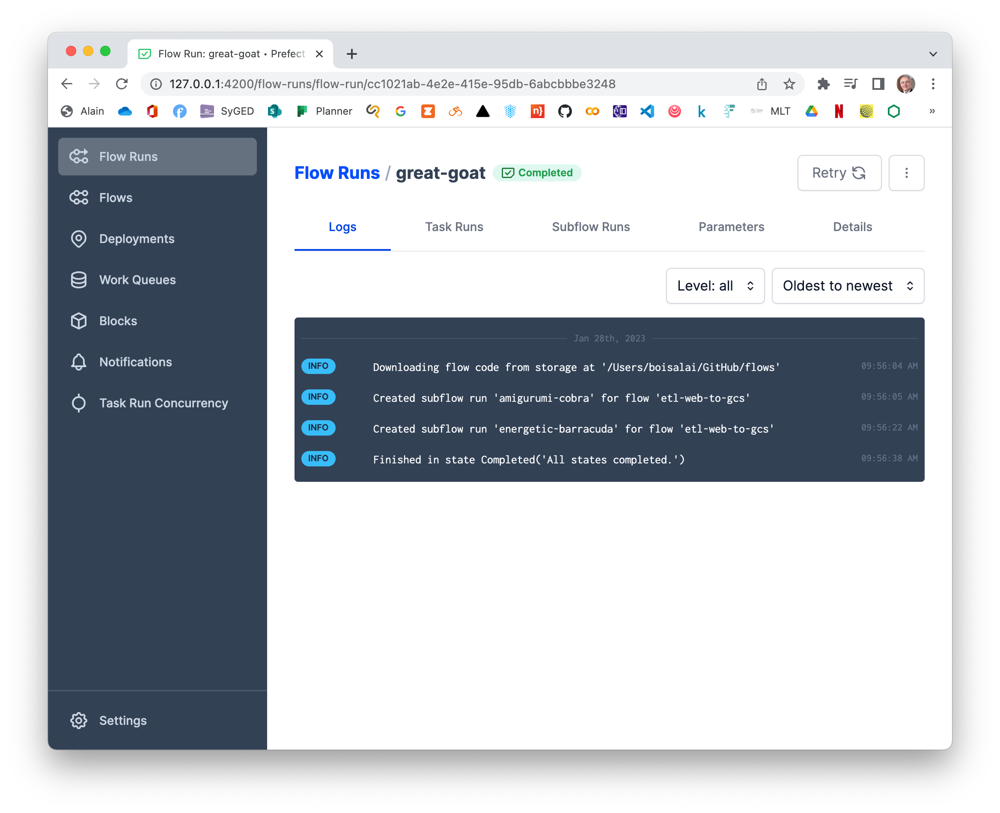

## Notifications

> 15:45/17:22

We can setup a notification.

Go to the Orion UI, select **Notifications** and create a notification.


Quit the terminal window with `Ctrl+C`.

We should also delete the file created in the bucket.

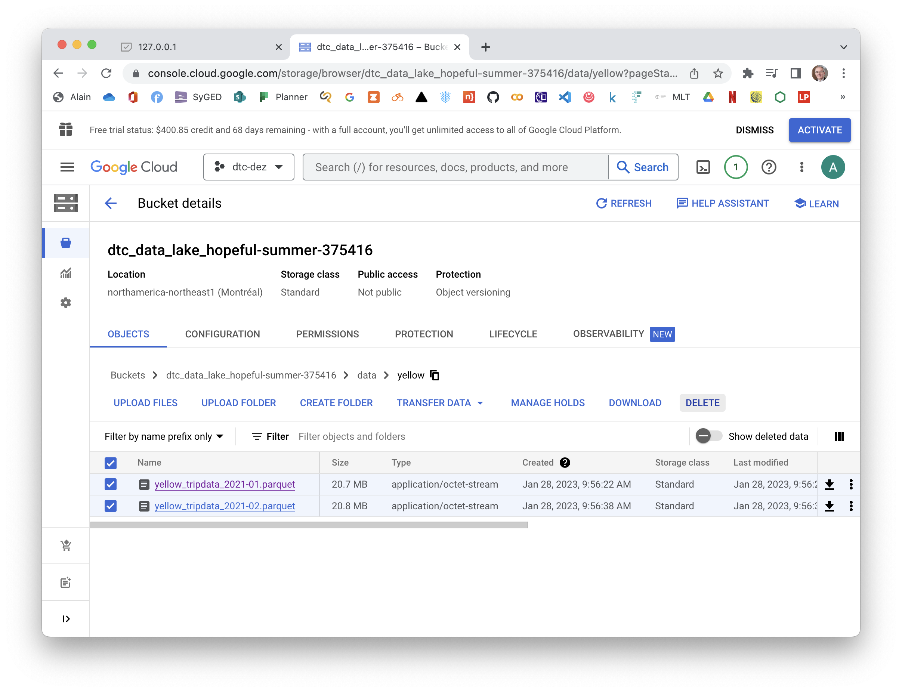

# 2.6 Schedules and Docker Storage with Infrastructure

> 2023-01-28

See [DE Zoomcamp 2.2.6 - Schedules & Docker Storage with Infrastructure](https://www.youtube.com/watch?v=psNSzqTsi-s) on
Youtube.

We will see in this section:

- Scheduling a deployment

- Flow code storage

- Running tasks in Docker

<div class="note">

From here, I moved the directories as follows:

``` txt
~/github/prefect/Dockerfile
~/github/prefect/docker-requirments.txt
~/github/prefect/data
~/github/prefect/flows
~/github/prefect/flows/03_deployments
~/github/prefect/flows/03_deployments/parameterized_flow.py
```

</div>

## Scheduling a deployment

> 0:13/24:20


See [Schedules](https://docs-v1.prefect.io/core/concepts/schedules.html) for more information.

> 2:28/24:30

Make sure that Prefect Orion UI is started.

``` bash
cd ~/github/prefect
conda activate zoom
prefect orion start
prefect deployment build flows/03_deployments/parameterized_flow.py:etl_parent_flow -n etl2 --cron "0 0 * * *" -a
```

We should see this in the terminal window.

``` txt
Found flow 'etl-parent-flow'
Default '.prefectignore' file written to /Users/boisalai/GitHub/prefect/.prefectignore
Deployment YAML created at '/Users/boisalai/GitHub/prefect/etl_parent_flow-deployment.yaml'.
Deployment storage None does not have upload capabilities; no files uploaded.  Pass --skip-upload to suppress this
warning.
Deployment 'etl-parent-flow/etl2' successfully created with id 'e580671d-3677-4e8d-8041-a6591ec0a92a'.

To execute flow runs from this deployment, start an agent that pulls work from the 'default' work queue:
$ prefect agent start -q 'default'
(zoom) ➜  prefect
```

We should see this on the Orion UI.

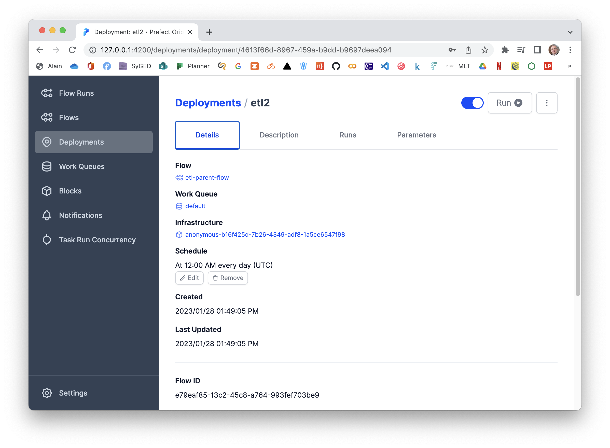

The link <https://crontab.guru/#0_0_*>*\**\* tells us *At 00:00.* and the next at 2023-01-29 00:00:00.

We can obtain help on prefect command.

``` bash
prefect deployment --help
prefect deployment build --help
prefect deployment apply --help
```

For example:

``` txt
✗ prefect deployment --help

 Usage: prefect deployment [OPTIONS] COMMAND [ARGS]...

 Commands for working with deployments.

╭─ Options ─────────────────────────────────────────────────────────────────────────────────────────╮
│ --help          Show this message and exit.                                                       │
╰───────────────────────────────────────────────────────────────────────────────────────────────────╯
╭─ Commands ────────────────────────────────────────────────────────────────────────────────────────╮
│ apply                Create or update a deployment from a YAML file.                              │
│ build                Generate a deployment YAML from /path/to/file.py:flow_function               │
│ delete               Delete a deployment.                                                         │
│ inspect              View details about a deployment.                                             │
│ ls                   View all deployments or deployments for specific flows.                      │
│ pause-schedule       Pause schedule of a given deployment.                                        │
│ resume-schedule      Resume schedule of a given deployment.                                       │
│ run                  Create a flow run for the given flow and deployment.                         │
│ set-schedule         Set schedule for a given deployment.                                         │
╰───────────────────────────────────────────────────────────────────────────────────────────────────╯
```

## Flow code storage

> 5:17/24:20

Let’s make a `Dockerfile`.

<div class="formalpara-title">

**File `~/github/prefect/Dockerfile`**

</div>

``` txt
FROM prefecthq/prefect:2.7.7-python3.9

COPY docker-requirements.txt .

RUN pip install -r docker-requirements.txt --trusted-host pypi.python.org --no-cache-dir

COPY flows /opt/prefect/flows
RUN mkdir -p /opt/prefect/data/yellow
```

<div class="formalpara-title">

**File `~/github/prefect/docker-requirements.txt`**

</div>

``` txt
pandas==1.5.2
prefect-gcp[cloud_storage]==0.2.4
protobuf==4.21.11
pyarrow==10.0.1
pandas-gbq==0.18.1
```

> 10:45/24:20

``` bash
cd ~/github/prefect
docker image build -t boisalai/prefect:zoom .
```

Note that `boisalai` is my dockerhub username.

> 11:10/24:20

Now, we want to push that image to your dockerhub.

Make sure you are already logged to dockerhub.

``` bash
cd ~/github/prefect
docker login -u boisalai
docker image push boisalai/prefect:zoom
```

> 12:00/24:20

Go to the Orion UI, select **Blocks** in the right menu, click the **+** button to add a **Docker Container** with these
information:

- **Block Name**: zoom

- **Type (Optional)** \> The type of infrastructure: docker-container

- **Image (Optional)** \> Tag of a Docker image to use: boisalai/prefect:zoom

- **ImagePullPolicy (Optional)**: ALWAYS

- **Auto Remove (Optional)**: ON

Then click on **Create** button.

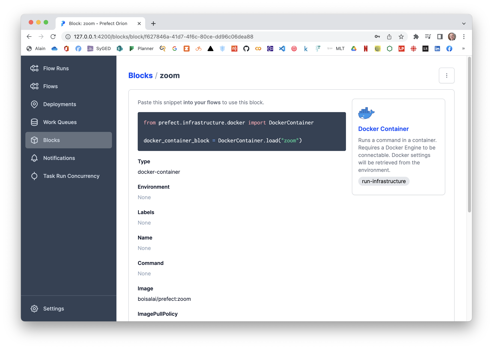

> 13:15/24:20

Note that it is also possible to create a DockerContainer block from python.

<div class="formalpara-title">

**File `make_docker_block.py`**

</div>

``` python
from prefect.infrastructure.docker import DockerContainer

# alternative to creating DockerContainer block in the UI
docker_block = DockerContainer(
    image="boisalai/prefect:zoom",  # insert your image here
    image_pull_policy="ALWAYS",
    auto_remove=True,
)

docker_block.save("zoom", overwrite=True)
```

> 13:55/24:20

We already know how to create a deployment file from command line. Now, we will create a deployment file from python.

<div class="formalpara-title">

**File `docker_deploy.py`**

</div>

``` python
from prefect.deployments import Deployment
from parameterized_flow import etl_parent_flow
from prefect.infrastructure.docker import DockerContainer

docker_block = DockerContainer.load("zoom")

docker_dep = Deployment.build_from_flow(
    flow=etl_parent_flow,
    name="docker-flow",
    infrastructure=docker_block,
)


if __name__ == "__main__":
    docker_dep.apply()
```

> 17:04/24:20

Then, execute this script with this command.

``` bash
cd ~/github/prefect
python flows/03_deployments/docker_deploy.py
```

Go to the Orion UI, select **Deployments** in the the menu. We should see the **docker-flow**. Click on it.


See a list of available profiles:

``` bash
cd ~/github/prefect
prefect profile ls
```

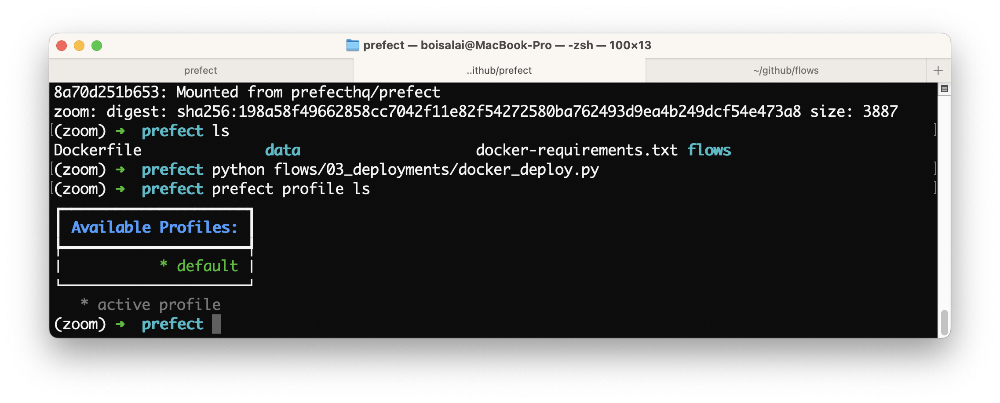

> 19:07/24:20

``` bash
cd ~/github/prefect
prefect config set PREFECT_API_URL="http://127.0.0.1:4200/api"
```


See [Setting and clearing values](https://docs.prefect.io/concepts/settings/#setting-and-clearing-values).

Now the docker interface could communicate with the Orion server.

> 20:09/24:20

``` bash
cd ~/github/prefect
prefect agent start -q default
```

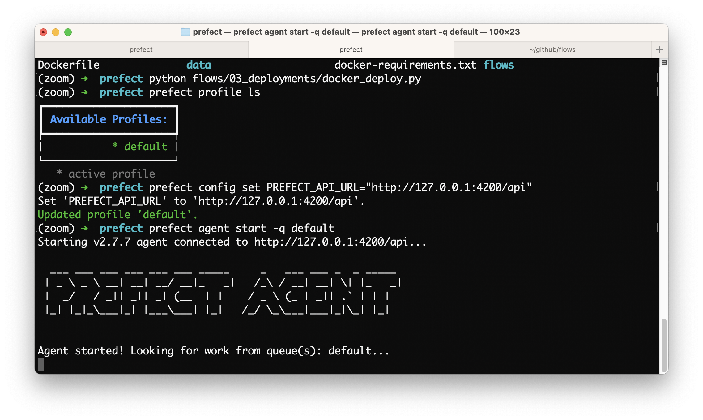

## Running tasks in Docker

Now we could run our flow from Orion UI or from command line. Here is how to do with command line.

``` bash
cd ~/github/prefect
conda activate zoom
prefect deployment run etl-parent-flow/docker-flow -p "months=[1,2]"
```

We should see this in the terminal window.

``` txt
Creating flow run for deployment 'etl-parent-flow/docker-flow'...
Created flow run 'precious-numbat'.
└── UUID: 133c8d13-ee98-4944-8f21-245af5db8b9b
└── Parameters: {'months': [1, 2]}
└── Scheduled start time: 2023-01-28 16:32:44 EST (now)
└── URL: http://127.0.0.1:4200/flow-runs/flow-run/133c8d13-ee98-4944-8f21-245af5db8b9b
```

You also should see some activities in the terminal window of the prefect agent.

<div class="warning">

**Message from Slack**

Hi folks!  
I’m struggling with Prefect and Docker. On the final step when I run the command
`prefect deployment run etl-parent-flow/docker-flow -p "months=[1,2]"`, it starts and crash when run the task
`etl_gcs_to_bq.transform`.  
Have I to specified the volume for Prefect when I create the dockerfile?

``` txt
ValueError: Path /root/.prefect/storage/44bf1741162a49e8a0a878cc4a87824e does not exist.
12:45:05.414 | ERROR   | Flow run 'camouflaged-dragonfly' - Finished in state Failed('Flow run encountered an exception. ValueError: Path /root/.prefect/storage/44bf1741162a49e8a0a878cc4a87824e does not exist.\n')
```

I’ve come across with the solution reading this note. Try removing  
`cache_key_fn=task_input_hash, cache_expiration=timedelta(days=1)` from the task `ingest_data`. Now it crash in other
place, but it solves this issue ;) (edited)

I apply this solution and I start again from 10:45

</div>

Let’s go watch this in the Orion UI.


> 21:45/24:20

Click on **Deployments**, select **docker-flow**, select **Runs** tab.

<div class="warning">

I am now getting the following error:

``` txt
Flow run encountered an exception. google.auth.exceptions.DefaultCredentialsError: Could not automatically determine credentials. Please set GOOGLE_APPLICATION_CREDENTIALS or explicitly create credentials and re-run the application. For more information, please see https://cloud.google.com/docs/authentication/getting-started
```

To solve this problem, I have go into Orion server, I selected my **zoom-gcs** block and I added in the field **Gcp
Credentials** my **zoom-gcp-creds**.

</div>

The files appeared in my google bucket with no error message!

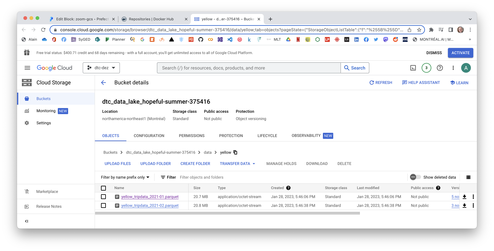

## Conclusion

> 23:30/24:30

We’ve seen how to bring our code into a Docker container and a Docker image, put that Docker image into our docker hub
and run this docker container on the remote machine.

## See also

- [Jeff Hale - Supercharge your Python code with Blocks \| PyData NYC 2022](https://www.youtube.com/watch?v=sR9fNHfOETw)

# 2.7 Prefect Cloud and Additional Resources

See [DE Zoomcamp 2.2.7 - Prefect Cloud/Additional resources](https://www.youtube.com/watch?v=gGC23ZK7lr8).

We will see:

- Using Prefect Cloud instead of local Prefect

- Workspaces

- Running flows on GCP

Recommended links:

- [Prefect docs](https://docs.prefect.io/)

- [Prefect Discourse](https://discourse.prefect.io/)

- [Prefect Cloud](https://app.prefect.cloud/)

- [Prefect Slack](https://prefect-community.slack.com/)

- [Anna Geller GutHub](https://github.com/anna-geller)
